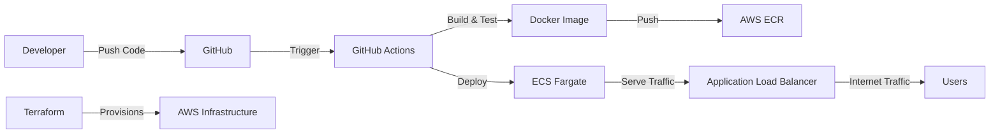

# FastAPI Fargate Pipeline

- A production-ready CI/CD pipeline for FastAPI applications deployed to AWS ECS Fargate using GitHub Actions and Terraform Infrastructure as Code.


## ✨ Features

- FastAPI Application** with built-in health checks and monitoring
- **Docker Containerization** with multi-stage builds for optimization
- **AWS ECS Fargate** serverless container deployment
- **Application Load Balancer** with intelligent health checks
-  **GitHub Actions CI/CD** with automated testing and deployment
-  **Terraform Infrastructure as Code** for reproducible deployments
-  **CloudWatch Integration** for comprehensive logging and monitoring
-  **Security Best Practices** with IAM roles and ECR scanning
- **Zero-downtime deployments** with rolling updates
-  **Auto-scaling capabilities** built into ECS Fargate

## 🏗️ Architecture Overview



**Traffic Flow:**
```
Internet → ALB → ECS Fargate → FastAPI Application
```

## Quick Start Guide

### Prerequisites

Before you begin, ensure you have:
- AWS Account with appropriate permissions
- GitHub account
-  Terraform installed (`>= 1.0`)
-  AWS CLI configured locally
-  Git installed

### 1. Clone the Repository

```bash
git clone https://github.com/Copubah/fastapi-fargate-pipeline.git
cd fastapi-fargate-pipeline
```

### 2. Configure AWS Credentials

#### Option A: AWS CLI (Recommended for local development)
```bash
aws configure
```

#### Option B: GitHub Secrets (Required for CI/CD)
Navigate to your repository on GitHub:
1. Go to **Settings** → **Secrets and variables** → **Actions**
2. Click **"New repository secret"**
3. Add the following secrets:
   - `AWS_ACCESS_KEY_ID`: Your AWS access key ID
   - `AWS_SECRET_ACCESS_KEY`: Your AWS secret access key

### 3. Deploy Infrastructure

```bash
# Navigate to terraform directory
cd terraform

# Initialize Terraform
terraform init

# Review the planned changes
terraform plan

# Apply the infrastructure
terraform apply
```

**Expected Resources Created:**
- ECS Fargate Cluster
- Application Load Balancer
- ECR Repository
- Security Groups
- IAM Roles
- CloudWatch Log Groups

### 4. Deploy Your Application

#### Automatic Deployment (Recommended)
Simply push to the main branch:
```bash
git add .
git commit -m "Deploy FastAPI application"
git push origin main
```

#### Manual Deployment
```bash
# Get ECR repository URL
terraform output ecr_repository_url

# Build and push Docker image manually
docker build -t your-app .
docker tag your-app:latest $(terraform output -raw ecr_repository_url):latest
docker push $(terraform output -raw ecr_repository_url):latest
```

### 5. Access Your Application

After successful deployment:

```bash
# Get your application URL
terraform output load_balancer_url

# Test the endpoints
curl $(terraform output -raw load_balancer_url)
curl $(terraform output -raw load_balancer_url)/health
```

## Project Structure

```
fastapi-fargate-pipeline/
├── 📂 app/                          # FastAPI application code
│   ├── __init__.py
│   └── main.py                      # Main application file
├── 📂 tests/                        # Test suite
│   ├── __init__.py
│   └── test_main.py                 # Unit tests
├── 📂 terraform/                    # Infrastructure as Code
│   ├── main.tf                      # Main Terraform configuration
│   ├── variables.tf                 # Input variables
│   └── outputs.tf                   # Output values
├── 📂 .github/
│   └── 📂 workflows/
│       └── deploy.yml               # CI/CD pipeline configuration
├── 🐳 Dockerfile                    # Container configuration
├── 📋 requirements.txt              # Python dependencies
├── 🚫 .dockerignore                 # Docker build exclusions
├── 🚫 .gitignore                    # Git exclusions
└── 📖 README.md                     # This file
```

## Configuration & Customization

### Application Configuration

- `terraform/variables.tf` to customize your deployment:

```hcl
variable "app_name" {
  description = "Name of the application"
  type        = string
  default     = "my-fastapi-app"  # Change this
}

variable "aws_region" {
  description = "AWS region for deployment"
  type        = string
  default     = "us-west-2"       # Change this
}
```

### Environment Variables

The application supports these environment variables:
- `ENVIRONMENT`: Deployment environment (dev/staging/prod)
- `DEBUG`: Enable debug logging (true/false)
- `LOG_LEVEL`: Logging level (INFO/DEBUG/WARNING/ERROR)

### Scaling Configuration

Modify the ECS service in `terraform/main.tf`:

```hcl
resource "aws_ecs_service" "app" {
  # ... other configuration ...
  desired_count = 2  # Change number of running tasks
  
  # Enable auto-scaling (add this block)
  deployment_configuration {
    maximum_percent         = 200
    minimum_healthy_percent = 100
  }
}
```

## 🛡️ Security Features

### Built-in Security Measures

- 🔐 **IAM Roles**: Least privilege access for ECS tasks
- 🔍 **ECR Scanning**: Automatic vulnerability scanning of Docker images
- 🛡️ **Security Groups**: Network-level access controls
- 🚫 **No Root Access**: Containers run as non-root user
- 🔒 **HTTPS Ready**: Easy SSL/TLS certificate integration
- 🗝️ **Secrets Management**: Secure handling of sensitive data

### Recommended Security Enhancements

```bash
# Enable GuardDuty for threat detection
aws guardduty create-detector --enable

# Set up AWS Config for compliance monitoring
aws configservice put-configuration-recorder --configuration-recorder name=default,roleARN=arn:aws:iam::123456789012:role/aws-config-role

# Enable VPC Flow Logs
aws ec2 create-flow-logs --resource-type VPC --resource-ids vpc-12345678 --traffic-type ALL
```

## 📊 Monitoring & Observability

### Built-in Monitoring

- **CloudWatch Logs**: Centralized application logging
- **ECS Container Insights**: Container-level metrics
- **ALB Metrics**: Load balancer performance metrics
- **Health Checks**: Application and infrastructure health monitoring

### Custom Monitoring Setup

Add custom metrics to your FastAPI application:

```python
# In your app/main.py
import time
from fastapi import FastAPI
import logging

# Configure structured logging
logging.basicConfig(
    level=logging.INFO,
    format='{"timestamp":"%(asctime)s","level":"%(levelname)s","message":"%(message)s"}'
)

app = FastAPI()

@app.middleware("http")
async def log_requests(request, call_next):
    start_time = time.time()
    response = await call_next(request)
    process_time = time.time() - start_time
    
    logging.info({
        "method": request.method,
        "url": str(request.url),
        "status_code": response.status_code,
        "process_time": process_time
    })
    return response
```

### Alerting Setup

Create CloudWatch alarms:

```bash
# High error rate alarm
aws cloudwatch put-metric-alarm \
  --alarm-name "FastAPI-High-Error-Rate" \
  --alarm-description "Alert when error rate is high" \
  --metric-name "HTTPCode_Target_5XX_Count" \
  --namespace "AWS/ApplicationELB" \
  --statistic "Sum" \
  --period 300 \
  --threshold 10 \
  --comparison-operator "GreaterThanThreshold"
```

## 🔄 CI/CD Pipeline Details

### Pipeline Stages

1. **🧪 Test Stage**
   - Run unit tests with pytest
   - Code linting with flake8
   - Security scanning (optional)

2. **🏗️ Build Stage**
   - Build Docker image
   - Run security scans
   - Push to ECR

3. **🚀 Deploy Stage**
   - Update ECS service
   - Health check validation
   - Rollback on failure

### Pipeline Configuration

Customize `.github/workflows/deploy.yml`:

```yaml
env:
  AWS_REGION: us-west-2
  ECR_REPOSITORY: fastapi-app
  ECS_SERVICE: fastapi-app
  ECS_CLUSTER: fastapi-app
  # Add custom environment variables here
```

### Branch Protection

Set up branch protection rules:
1. Go to **Settings** → **Branches**
2. Add rule for `main` branch
3. Enable:
   - Require pull request reviews
   - Require status checks to pass
   - Require branches to be up to date

## 🚨 Troubleshooting Guide

### Common Issues & Solutions

#### 🔴 Terraform Apply Fails

```bash
# Check AWS credentials
aws sts get-caller-identity

# Validate Terraform configuration
terraform validate

# Check for resource conflicts
terraform refresh
```

#### 🔴 GitHub Actions Deployment Fails

**Check these items:**
- ✅ AWS credentials are correctly set in GitHub Secrets
- ✅ IAM user has necessary permissions
- ✅ ECR repository exists and is accessible
- ✅ ECS cluster is running

**Debug commands:**
```bash
# Check ECS service status
aws ecs describe-services --cluster fastapi-app --services fastapi-app

# Check CloudWatch logs
aws logs describe-log-groups --log-group-name-prefix "/ecs/fastapi-app"
```

#### 🔴 Application Not Responding

```bash
# Check ALB target health
aws elbv2 describe-target-health --target-group-arn <your-target-group-arn>

# Check ECS task health
aws ecs describe-tasks --cluster fastapi-app --tasks <task-arn>

# View application logs
aws logs get-log-events --log-group-name "/ecs/fastapi-app" --log-stream-name <stream-name>
```

#### 🔴 Docker Build Issues

```bash
# Build locally to debug
docker build -t fastapi-app .

# Check Docker logs
docker run -it fastapi-app /bin/bash

# Test health endpoint
curl -f http://localhost:8000/health
```

### Performance Optimization

#### 🚀 Application Performance

```python
# Add caching to your FastAPI app
from fastapi_cache import FastAPICache
from fastapi_cache.backends.redis import RedisBackend

@app.on_event("startup")
async def startup():
    redis = aioredis.from_url("redis://localhost", encoding="utf8", decode_responses=True)
    FastAPICache.init(RedisBackend(redis), prefix="fastapi-cache")
```

#### 🚀 Infrastructure Performance

```hcl
# Optimize ECS task definition
resource "aws_ecs_task_definition" "app" {
  cpu    = 512   # Increase for better performance
  memory = 1024  # Increase for memory-intensive apps
}
```

## 🤝 Contributing

We welcome contributions! Please follow these steps:

### Development Setup

```bash
# Clone the repository
git clone https://github.com/Copubah/fastapi-fargate-pipeline.git
cd fastapi-fargate-pipeline

# Create virtual environment
python -m venv venv
source venv/bin/activate  # On Windows: venv\Scripts\activate

# Install dependencies
pip install -r requirements.txt
pip install -r requirements-dev.txt  # If you create this file

# Run tests
pytest tests/

# Run application locally
uvicorn app.main:app --reload
```

### Contribution Guidelines

1. 🍴 **Fork** the repository
2. 🌿 **Create** a feature branch (`git checkout -b feature/amazing-feature`)
3. ✅ **Add tests** for your changes
4. 📝 **Commit** your changes (`git commit -m 'Add amazing feature'`)
5. 📤 **Push** to the branch (`git push origin feature/amazing-feature`)
6. 🔃 **Open** a Pull Request

### Code Standards

- Follow PEP 8 for Python code
- Add type hints where possible
- Include docstrings for functions
- Maintain test coverage above 80%

## 📚 Additional Resources

### Documentation Links
- [FastAPI Documentation](https://fastapi.tiangolo.com/)
- [AWS ECS Documentation](https://docs.aws.amazon.com/ecs/)
- [Terraform AWS Provider](https://registry.terraform.io/providers/hashicorp/aws/latest/docs)
- [GitHub Actions Documentation](https://docs.github.com/en/actions)

### Related Projects
- [FastAPI Best Practices](https://github.com/zhanymkanov/fastapi-best-practices)
- [AWS ECS Examples](https://github.com/aws-samples/aws-ecs-devops-using-aws-cdk)
- [Terraform AWS Modules](https://github.com/terraform-aws-modules)

### Community
- [FastAPI Discord](https://discord.gg/VQjSZaeJmf)
- [AWS Developers Slack](https://awsdevelopers.slack.com/)
- [Terraform Community](https://discuss.hashicorp.com/c/terraform-core)

## 📄 License

This project is licensed under the MIT License - see the [LICENSE](LICENSE) file for details.

```
MIT License

Copyright (c) 2024 Copubah

Permission is hereby granted, free of charge, to any person obtaining a copy
of this software and associated documentation files (the "Software"), to deal
in the Software without restriction, including without limitation the rights
to use, copy, modify, merge, publish, distribute, sublicense, and/or sell
copies of the Software, and to permit persons to whom the Software is
furnished to do so, subject to the following conditions:

The above copyright notice and this permission notice shall be included in all
copies or substantial portions of the Software.

THE SOFTWARE IS PROVIDED "AS IS", WITHOUT WARRANTY OF ANY KIND, EXPRESS OR
IMPLIED, INCLUDING BUT NOT LIMITED TO THE WARRANTIES OF MERCHANTABILITY,
FITNESS FOR A PARTICULAR PURPOSE AND NONINFRINGEMENT. IN NO EVENT SHALL THE
AUTHORS OR COPYRIGHT HOLDERS BE LIABLE FOR ANY CLAIM, DAMAGES OR OTHER
LIABILITY, WHETHER IN AN ACTION OF CONTRACT, TORT OR OTHERWISE, ARISING FROM,
OUT OF OR IN CONNECTION WITH THE SOFTWARE OR THE USE OR OTHER DEALINGS IN THE
SOFTWARE.
```

## 🙋‍♂️ Support & Contact

If you need help or have questions:

- 📧 **Create an Issue**: [GitHub Issues](https://github.com/Copubah/fastapi-fargate-pipeline/issues)
- 💬 **Discussions**: [GitHub Discussions](https://github.com/Copubah/fastapi-fargate-pipeline/discussions)
- 🌟 **Star this repo** if it helped you!

---

<div align="center">

**Built with ❤️ by [Copubah](https://github.com/Copubah)**

If this project helped you, please consider giving it a ⭐!

[⬆ Back to Top](#fastapi-fargate-pipeline)

</div>